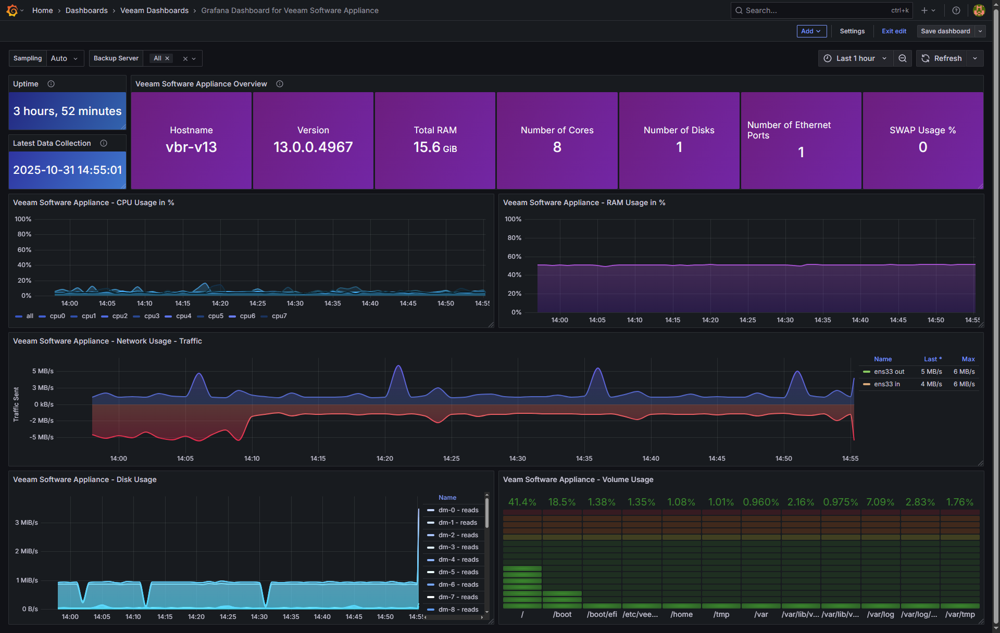

# Veeam Software Appliance Node-Like Metrics to InfluxDB

NOT SUPPORTED. Collect core Linux host metrics with the lowest privileges and write them directly to InfluxDB v2 every minute.  
No sudo. No extra packages. Just Bash, `/proc`, `/sys`, and `curl`.

> The script emits Prometheus-style metric names like `node_cpu_seconds_total`, `node_memory_MemAvailable_bytes`, `node_filesystem_size_bytes`, etc., then posts them to InfluxDB v2 using the write API.

---

## Screenshot



Log:

```
[INFO] Checking InfluxDB health at https://veeamtech.ddns.net:8086/health
[INFO] InfluxDB health OK
[INFO] cpu: preparing to send 90 line(s)
[SAMPLE] node_cpu_seconds_total,instance=vbr-v13,serverName=vbr-v13,version=13.0.0.4967,cpu=cpu0,mode=softirq value=860.860000 1761842788978656645
[INFO] cpu: write OK (HTTP 204)
...
[INFO] Done.
```

---

## Features

- Lowest privilege collection, works as any regular user (requires Host Manager role)
- No external dependencies, only standard tools present on Rocky Linux
- Prometheus-like metric names and labels for easy mental mapping
- InfluxDB v2 line protocol with per-section writes and debug logs
- Health check of Influx endpoint
- Optional dry-run mode for safe validation
- Version tag pulled from `veeamtransport -v` when available, with `uname -r` fallback

---

## What is collected

| Area | Metrics (selection) | Labels |
|---|---|---|
| Time | `node_time_seconds`, `node_boot_time_seconds` | `instance`, `serverName`, `version` |
| CPU | `node_cpu_seconds_total{cpu,mode}` for each cpuN and `cpu=all` | `cpu`, `mode` |
| Load | `node_load1`, `node_load5`, `node_load15` | — |
| Memory | `node_memory_MemTotal_bytes`, `node_memory_MemAvailable_bytes`, `node_memory_SwapFree_bytes`, etc. | — |
| Filesystems | `node_filesystem_size_bytes`, `node_filesystem_free_bytes`, `node_filesystem_avail_bytes` | `device`, `fstype`, `mountpoint` |
| Disks | `node_disk_reads_completed_total`, `node_disk_read_bytes_total`, `node_disk_write_time_seconds_total`, etc. | `device` |
| Network | `node_network_receive_bytes_total`, `node_network_transmit_packets_total`, `*_errs_total`, `*_drop_total` | `interface` |
| Temperatures (not available when virtual) | `node_thermal_zone_temp_celsius` when `/sys/class/thermal` is present | `sensor` |

Tags always include `instance`, `serverName`, `version`.

---

## Requirements

- Rocky Linux or similar with `/proc` and `/sys`
- `bash`, `awk`, `sed`, `grep`, `curl`
- Outbound access to your InfluxDB v2 endpoint

---

## Installation

1. Create folders and place the script inside Veeam Software Appliance

   ```bash
   mkdir -p "$HOME/bin" "$HOME/logs"
   vi "$HOME/bin/veeam_appliance.sh"
   chmod +x "$HOME/bin/veeam_appliance.sh"
   ```

2. Create an environment file for secrets.

   ```bash
   cat > $HOME/.veeam_influx.env <<'EOF'
   INFLUX_PROTO=https
   INFLUX_HOST=yourinfluxdbhost
   INFLUX_PORT=8086
   INFLUX_ORG="YOURORG"
   INFLUX_BUCKET=telegraf
   INFLUX_TOKEN="PASTE_YOUR_TOKEN_HERE"
   CURL_INSECURE=true
   DEBUG=true
   # Optional
   # DRY_RUN=false
   EOF
   chmod 600 $HOME/.veeam_influx.env
   ```

3. Manual test.

   ```bash
   set -a
   . $HOME/.veeam_influx.env
   set +a

   bash "$HOME/bin/veeam_appliance.sh" | tee -a "$HOME/logs/veeam_appliance_$(date +%F).log"
   ```

   You should see `[INFO] ... write OK (HTTP 204)` for each section.

---

## Scheduled execution with cron

Append one line to your user crontab. This runs every minute, creates the log dir if needed, and appends to a daily log. So do the usual crontab -e

```cron
* * * * * /bin/bash -lc '. $HOME/.veeam_influx.env; mkdir -p "$HOME/logs"; LOG="$HOME/logs/veeam_appliance_$(date +\%F).log"; /bin/bash "$HOME/bin/veeam_appliance.sh" >>"$LOG" 2>&1'
```

Log rotation for 14 days:

```cron
0 3 * * * /bin/bash -lc 'find "$HOME/logs" -name "veeam_appliance_*.log" -mtime +14 -delete'
```

Notes
- Keep the cron line on a single physical line
- Percent signs in `date` must be escaped as `\%`
- If your editor inserts CRLF, convert with `sed -i "s/\r$//" file`

---

## InfluxDB destination

This project writes to the InfluxDB v2 write API.

- URL pattern  
  `http[s]://HOST:PORT/api/v2/write?org=ORG&bucket=BUCKET&precision=ns`
- Header  
  `Authorization: Token <INFLUX_TOKEN>`
- Payload  
  InfluxDB line protocol, one metric per line

Example line

```
node_filesystem_size_bytes,instance=vbr-v13,serverName=vbr-v13,version=13.0.0.4967,device=/dev/mapper/systemvol-system,fstype=xfs,mountpoint=/ value=48294789120 1761842788978656645
```

---

## Grafana

You can query these metrics in Grafana via the InfluxDB v2 data source. A few example Flux queries:

- CPU total seconds by mode
  ```flux
  from(bucket: "telegraf")
    |> range(start: -1h)
    |> filter(fn: (r) => r._measurement == "node_cpu_seconds_total" and r.cpu == "all")
    |> group(columns: ["mode"])
    |> derivative(unit: 1s, nonNegative: true)
  ```

- Memory available
  ```flux
  from(bucket: "telegraf")
    |> range(start: -24h)
    |> filter(fn: (r) => r._measurement == "node_memory_MemAvailable_bytes")
  ```

- Network bytes by interface
  ```flux
  from(bucket: "telegraf")
    |> range(start: -1h)
    |> filter(fn: (r) => r._measurement == "node_network_receive_bytes_total" or r._measurement == "node_network_transmit_bytes_total")
    |> derivative(unit: 1s, nonNegative: true)
    |> group(columns: ["interface"])
  ```

---

## Security notes

- The script runs as a standard user (with Host Manager permissions)
- Token is kept outside the script in a protected file
- If your InfluxDB has a valid certificate set `CURL_INSECURE=false`
- Restrict outbound access to only your Influx endpoint where possible

---

## Troubleshooting

- `HTTP 401` or `403`  
  The token does not have write permissions to the target bucket or the org is wrong
- `HTTP 404`  
  Wrong write URL or reverse proxy path, confirm `/api/v2/write`
- `HTTP 204` but no data in Grafana  
  Wrong bucket or wrong time range, check server clock and precision `ns`
- `crontab: bad minute`  
  The line wrapped or `%` not escaped, ensure single line with `\%F`
- Empty sections  
  Some systems do not expose temperatures or have interfaces down

Use `DRY_RUN=true` to print payloads without writing to Influx. Set `DEBUG=true` to see counts and a sample line for each block.

---

## License

MIT. Use it, adapt it, and please contribute improvements.
